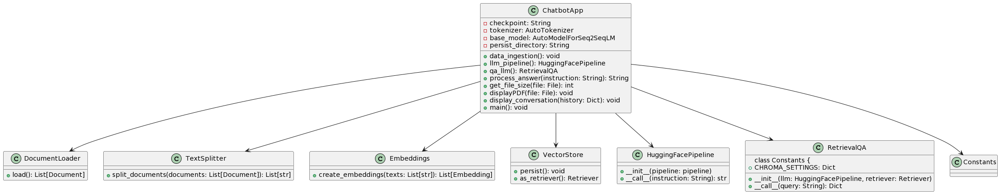

## PDF Chatbot with Streamlit

This is a simple chatbot application that allows users to interact with PDF documents using natural language queries. The chatbot leverages the power of language models, embeddings, and vector stores to provide relevant responses to user queries.

Overview

The PDF Chatbot with Streamlit is built using Streamlit, Transformers, Sentence Transformer, and other libraries. It enables users to upload PDF documents, ask questions about the content of the documents, and receive informative responses.

The application follows these main steps:

- Document Ingestion and Embeddings Creation: PDF files are ingested and split into text chunks. Sentence embeddings are created using the Sentence Transformer model to represent text.

- Vector Storage: Embeddings are stored in a vector database using Chroma, an open-source vector store.

- Language Model (LLM) Pipeline: A language model (LLM) pipeline is created using Hugging Face Transformers to generate informative responses based on user queries.

- User Interaction: Users can interact with the chatbot by inputting natural language queries. The chatbot retrieves relevant responses from the LLM pipeline and displays a conversation history.

______________
1st run this :
```
# Make sure you have git-lfs installed (https://git-lfs.com)
git lfs install
git clone https://huggingface.co/MBZUAI/LaMini-T5-738M
```

This clones the lamini llm from Hugging face and make a new directory in work env (~2Gb)

2nd :
Place new document in docs file directory

3rd :
```
python ingest.py
```
This will create embeddings and chroma vector store of the file u placed in docs

4th
```
streamlit run chatbot_app.py
```

This will run the streamlit window where user can inquire the file.

----> u may run it errors if the sqlite db, duckduck db is not upto date... ideally run this with python 3.10 or above versions for need for supporting libraries

______________
```commandline
pip install -r requirements.txt
```
Run the Streamlit app:
```
streamlit run your_script_name.py
```
Access the chatbot by opening the provided URL in your web browser.


Getting Started

To run the PDF Chatbot with Streamlit, follow these steps:

- Clone this repository to your local machine.

- Install the required dependencies using the provided requirements.txt file:

```commandline
pip install -r requirements.txt
```
Run the Streamlit app:
```
streamlit run your_script_name.py
```
Access the chatbot by opening the provided URL in your web browser.

Usage

    Upload a PDF file: Upload a PDF document through the interface.

    Interact with the chatbot: Enter natural language queries related to the content of the uploaded PDF document.

    View responses: The chatbot will display responses based on user queries. The conversation history is displayed, showing both user inputs and generated responses.

Dependencies

The PDF Chatbot with Streamlit relies on the following libraries and tools:

    Streamlit
    Transformers (Hugging Face)
    Sentence Transformer
    PyPDF2 (for PDF processing)
    Chroma (for vector storage)
    Other dependencies listed in the requirements.txt file
_________
#### Setup and Requirements:
Gather PDF files for indexing.
        Ensure a system with at least 16GB of RAM (8GB for basic functionality).
        Install Python 3.10.
        Install the "accelerate" library for running large models.
        Use the "Sentence Transformer" library for creating embeddings.

#### Text Pre-processing:
Load PDF files using "LINE chain."
        Utilize text splitter modules to divide text into chunks for processing.

#### Embeddings Creation:
Apply Sentence Transformer with Mini LM (Version 6) to generate embeddings.


#### Vector Storage:
Choose an open-source option like Chroma DB for storing embeddings.
        Optionally, consider Pine Cone or Fast (CPU/GPU) for vector storage.

#### Inference Pipeline:
Utilize an LLM pipeline from Hugging Face (e.g., LLM T5-738).
        Perform inference on embeddings to generate responses.

#### Retrieval and Querying:
Combine Line Chain and Retriever Chain for retrieval process.
        Retrieve embeddings using Chroma DB.

#### Advantages of Vector Stores:
Vector databases offer lower-dimensional space.
        Built-in algorithms (e.g., cosine similarity) for semantic search and question answering.
        Suitable for various tasks such as chatbots and semantic search.

##### Open Source vs. Closed Source Models:
Workflow remains consistent; differences in specific tools and models used.

##### Implementation and Customization:
Implement the workflow with code, following the outlined steps.
        Customize components as needed based on requirements.

#### Result and Usage:
The implemented search tool allows users to query PDF files for information.
    Utilizes embeddings, inference, and retrieval to provide relevant responses.

#### Future Enhancements:
Consider additional layers or techniques for further customization.
    Explore different vector storage options based on project needs.
__________

## UML


